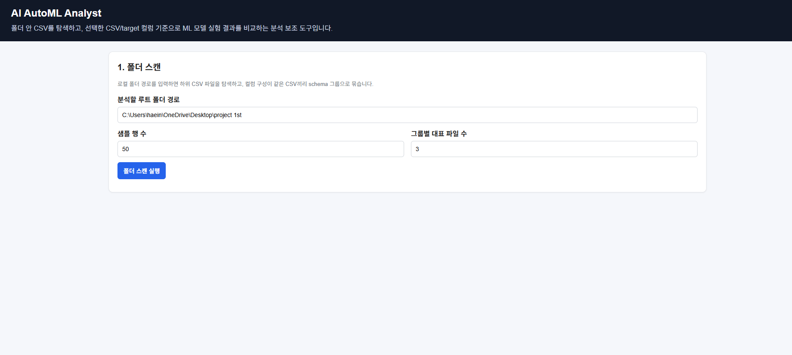
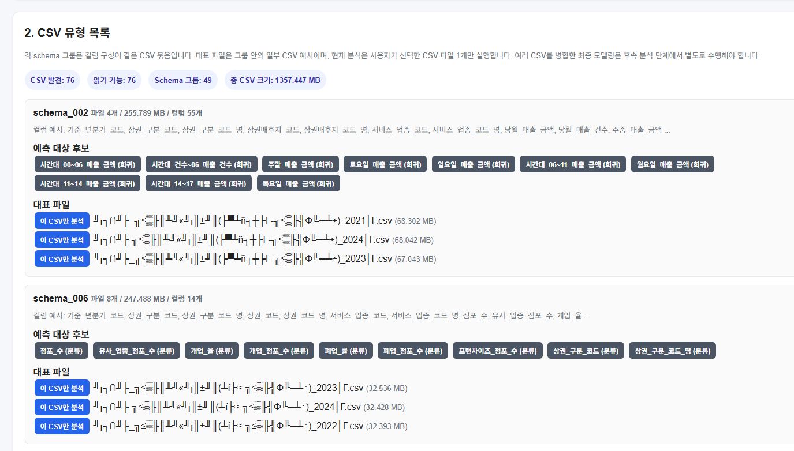
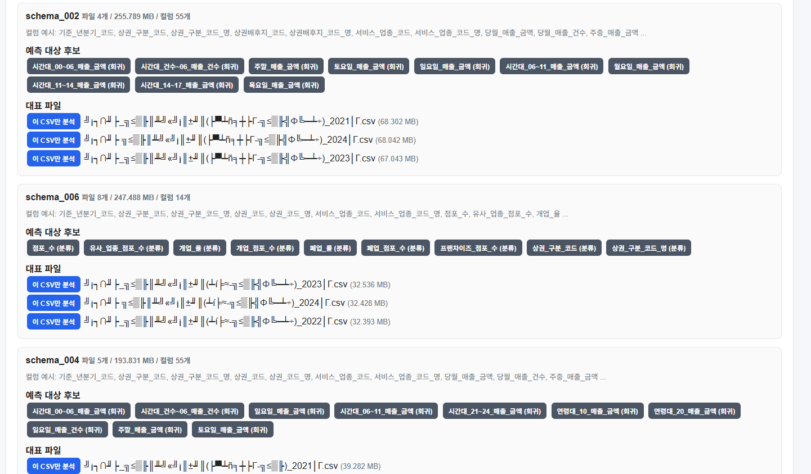
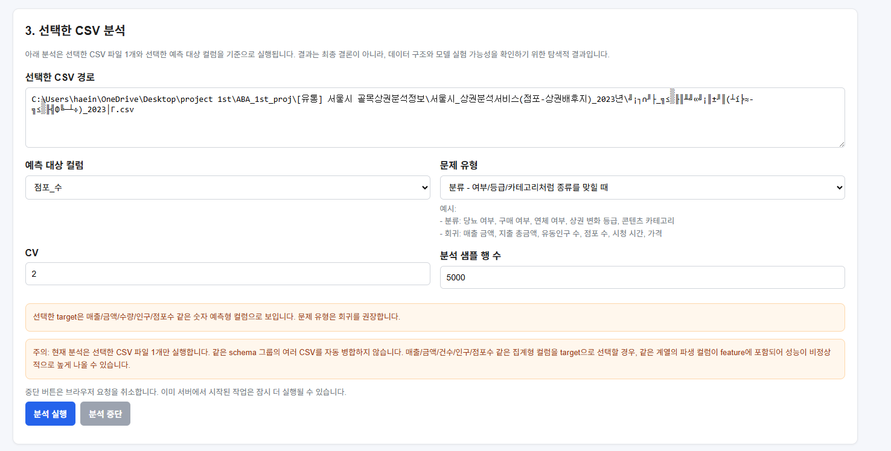
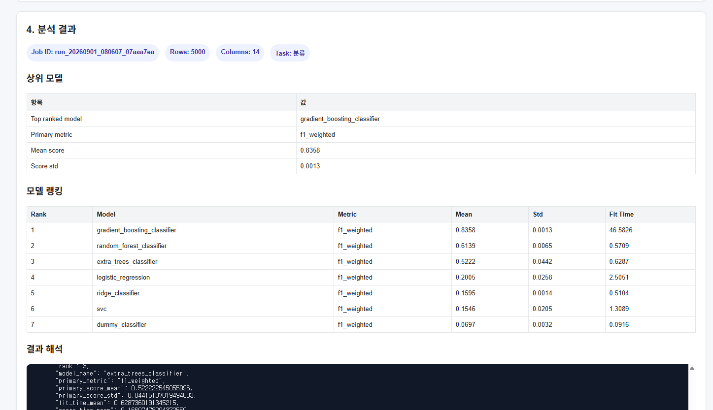
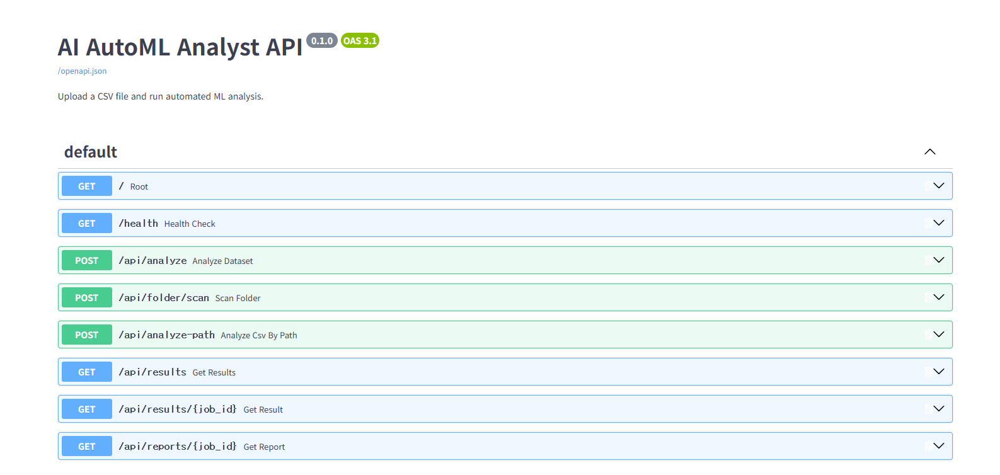

\# AI AutoML Analyst


AI AutoML Analyst는 로컬 폴더 안의 CSV 파일을 탐색하고, 사용자가 선택한 CSV와 target 컬럼을 기준으로 여러 머신러닝 모델을 자동 실험하여 결과를 비교해주는 FastAPI 기반 AutoML 분석 보조 도구입니다.


이 프로젝트는 특정 데이터셋 하나만 분석하는 노트북이 아니라, 다양한 CSV 데이터셋을 빠르게 훑어보고 머신러닝 실험 가능성을 확인하기 위한 도구입니다.


\---


\## 주요 기능


\- 로컬 폴더 내 CSV 파일 자동 탐색

\- CSV 컬럼 구조 기준 schema group 생성

\- schema group별 대표 CSV 파일 표시

\- CSV별 컬럼 목록 및 예측 대상 후보 확인

\- 선택한 CSV 파일 1개 기준 AutoML 분석 실행

\- Classification / Regression 실험 지원

\- 데이터 크기에 따른 모델 후보 자동 선택

\- 여러 ML 모델 Cross Validation 평가

\- 모델 성능 랭킹 생성

\- 결과 해석 및 Markdown 리포트 생성

\- 분석 결과 JSON / Markdown 저장

\- 저장된 분석 이력 조회

\- 간단한 웹 프론트엔드 제공


\---


\## 기술 스택


\- Python

\- pandas

\- scikit-learn

\- FastAPI

\- Uvicorn

\- HTML / CSS / JavaScript

\- Git


\---


\## 프로젝트 구조


```text

AI\_AutoML\_Analyst/

├─ backend/

│  └─ app/

│     ├─ main.py

│     ├─ models/

│     │  └─ registry.py

│     └─ services/

│        ├─ profiler.py

│        ├─ task\_detector.py

│        ├─ preprocessor.py

│        ├─ evaluator.py

│        ├─ trainer.py

│        ├─ ranker.py

│        ├─ automl\_runner.py

│        ├─ model\_selector.py

│        ├─ folder\_scanner.py

│        ├─ ai\_analyst.py

│        ├─ recommendation.py

│        ├─ report\_generator.py

│        └─ storage.py

├─ frontend/

│  └─ index.html

├─ data/

├─ experiments/

├─ tests/

├─ pyproject.toml

├─ .gitignore

└─ README.md
```


---

## 현재 한계

- 현재 분석은 선택한 CSV 파일 1개 기준으로 실행됩니다.
- 같은 schema group의 여러 CSV를 자동 병합하지는 않습니다.
- JSON, ZIP, SHP 등 비정형/공간 데이터는 분석 대상이 아닙니다.
- 대용량 CSV는 `sample_rows`를 사용한 샘플 분석을 권장합니다.
- target 후보는 자동 확정이 아니라 사용자가 선택하기 위한 참고 정보입니다.
- 분석 중단 버튼은 브라우저 요청 취소 수준이며, 서버 작업 완전 취소는 추후 개선 예정입니다.
- 집계형 데이터에서는 target과 같은 계열의 파생 컬럼이 feature에 포함될 경우 성능이 과도하게 높게 나올 수 있습니다.

---

## 향후 개선 방향

- target 후보 정렬 고도화
- 자동 분류/회귀 판단 개선
- 데이터 누수 가능성 탐지 강화
- schema group 단위 CSV 병합 분석
- 백그라운드 job 및 실제 작업 취소 기능
- React 기반 프론트엔드 개선
- PostgreSQL 기반 분석 이력 저장
- 테스트 코드 추가
- 배포 환경 구성

---

## 실행 요약

### 로컬 실행

```powershell
python -m venv .venv
.\.venv\Scripts\activate
pip install pandas scikit-learn fastapi uvicorn python-multipart
uvicorn backend.app.main:app --reload
```

브라우저:

```text
http://127.0.0.1:8000
http://127.0.0.1:8000/docs
```

프론트:

```text
frontend/index.html
```

---

### Docker 실행

```powershell
docker compose up --build
```

브라우저:

```text
http://127.0.0.1:8000
```

Docker에서 로컬 데이터 폴더를 스캔할 경우 `docker-compose.yml`에 volume을 연결한 뒤 프론트에서 `/data`를 입력합니다.

```yaml
volumes:
  - ./experiments:/app/experiments
  - "C:/Users/haein/OneDrive/Desktop/project 1st:/data"
```

---

## Repository

```text
https://github.com/hibi89/AI_AutoML_Analyst
```

---

## 화면 예시

### 1. 프론트 첫 화면



### 2. 폴더 스캔 결과



### 3. CSV 유형 목록



### 4. 분석 설정 화면



### 5. 분석 결과



### 6. Swagger 또는 Docker 실행 화면


